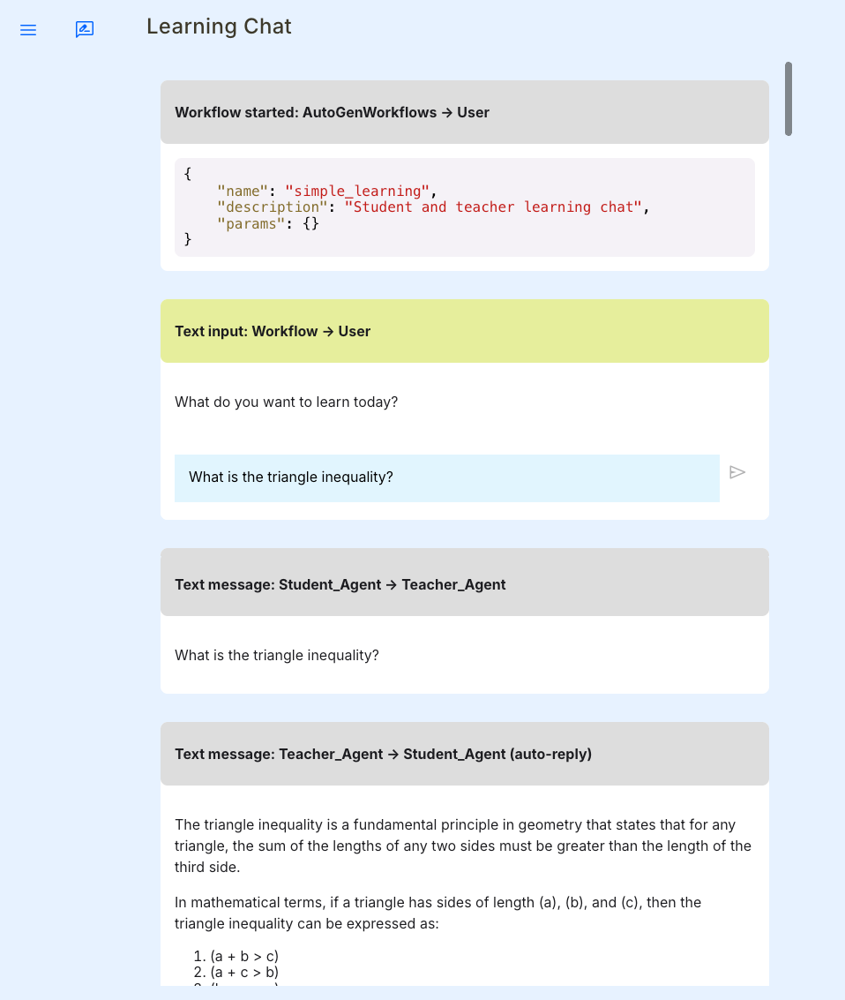

---
# 0.5 - API
# 2 - Release
# 3 - Contributing
# 5 - Template Page
# 10 - Default
hide:
  - navigation

search:
  boost: 10
---

# Getting Started with FastAgency


<b>The fastest way to bring multi-agent workflows to production.</b>


---

<p align="center">
  <a href="https://github.com/airtai/fastagency/actions/workflows/pipeline.yaml" target="_blank">
    
  </a>

  <a href="https://coverage-badge.samuelcolvin.workers.dev/redirect/airtai/fastagency" target="_blank">
      
  </a>

  <a href="https://www.pepy.tech/projects/fastagency" target="_blank">
    
  </a>

  <a href="https://pypi.org/project/fastagency" target="_blank">
    
  </a>

  <a href="https://pypi.org/project/fastagency" target="_blank">
    
  </a>

  <br/>

  <a href="https://github.com/airtai/fastagency/actions/workflows/codeql.yml" target="_blank">
    
  </a>

  <a href="https://github.com/airtai/fastagency/actions/workflows/dependency-review.yaml" target="_blank">
    
  </a>

  <a href="https://github.com/airtai/fastagency/blob/main/LICENSE" target="_blank">
    
  </a>

  <a href="https://github.com/airtai/fastagency/blob/main/CODE_OF_CONDUCT.md" target="_blank">
    
  </a>

  <a href="https://discord.gg/kJjSGWrknU" target="_blank">
      
  </a>
</p>

---

## What is FastAgency?

For start, FastAgency is not yet another agentic AI frameworks. There are many such
frameworks available today, the most popular open-source ones being [**AutoGen**](https://github.com/microsoft/autogen){target="_blank"}, [**CrewAI**](https://www.crewai.com/){target="_blank"}, [**Swarm**](https://github.com/openai/swarm){target="_blank"} and [**LangGraph**](https://github.com/langchain-ai/langgraph){target="_blank"}. FastAgency provides you with a unified programming interface for deploying agentic workflows written in above agentic frameworks in both development and productional settings (current version supports [**AutoGen**](https://github.com/microsoft/autogen){target="_blank"} only, but other frameworks will be supported very soon). With only a few lines of code, you can create a web chat application or REST API service interacting with agents of your choice. If you need to scale-up your workloads, FastAgency can help you deploy a fully distributed system using internal message brokers coordinating multiple machines in multiple datacenters with just a few lines of code changed from your local development setup.

In the rest of this guide, we will walk you through the initial setup and usage of FastAgency, using both development and production environments.

### Supported Runtimes

Currently, the only supported runtime is [**AutoGen**](https://github.com/microsoft/autogen){target="_blank"}, with support for [**CrewAI**](https://www.crewai.com/){target="_blank"}, [**Swarm**](https://github.com/openai/swarm){target="_blank"} and [**LangGraph**](https://github.com/langchain-ai/langgraph){target="_blank"} coming soon.

### Supported User Interfaces

FastAgency currently supports workflows defined using AutoGen and provides options for different types of applications:

- **Console**: Use the [**`ConsoleUI`**](../api/fastagency/ui/console/ConsoleUI.md) interface for command-line based interaction. This is ideal for developing and testing workflows in a text-based environment.

- [**Mesop**](https://google.github.io/mesop/){target="_blank"}: Utilize [**`MesopUI`**](../api/fastagency/ui/mesop/MesopUI.md) for web-based applications. This interface is suitable for creating web applications with a user-friendly interface.

### Supported Network Adapters

FastAgency can use chainable network adapters that can be used to easily create
scalable, production ready architectures for serving your workflows. Currently, we
support the following network adapters:

- [**REST API**](https://en.wikipedia.org/wiki/REST){target="_blank"} via [**FastAPI**](https://fastapi.tiangolo.com/){target="_blank"}: Use the [**`FastAPIAdapter`**](../api/fastagency/adapters/fastapi/FastAPIAdapter.md) to serve your workflow using [**FastAPI**](https://fastapi.tiangolo.com/){target="_blank"} server. This setup allows you to work your workflows in multiple workers and serve them using the highly extensible and stable ASGI server.

- [**NATS.io**](https://nats.io/){target="_blank"} via [**FastStream**](https://github.com/airtai/faststream){target="_blank"}: Utilize the [**`NatsAdapter`**](../api/fastagency/adapters/nats/NatsAdapter.md) to use [**NATS.io MQ**](https://nats.io/){target="_blank"} message broker for highly-scalable, production-ready setup. This interface is suitable for setups in VPN-s or, in combination with the [**`FastAPIAdapter`**](../api/fastagency/adapters/fastapi/FastAPIAdapter.md) to serve public workflows in an authenticated, secure manner.

## Quick start

We will show you four different setups, two for development and two for production workloads:

- Development setups

    - **Console**: This setup uses console for interactively executing your workflow.
        It is also very useful for automating testing and integration with CI/CD.


    - **Mesop**: This setup uses [**Mesop**](https://google.github.io/mesop/){target="_blank"}
        to build a web application for interacting with our workflow. It supports
        a single-worker deployments only, limiting its scalability. However, it
        is the fastest way to debug your application.

- Production setups

    - **FastAPI + Mesop**: This is fairly scalable setup using [**FastAPI**](https://fastapi.tiangolo.com/){target="_blank"} to execute your workflows and [**Mesop**](https://google.github.io/mesop/){target="_blank"} for interactive web application. [**FastAPI**](https://fastapi.tiangolo.com/){target="_blank"} supports execution with multiple workers, with each workflow being executed in the context of a WebSocket connection. [**Mesop**](https://google.github.io/mesop/){target="_blank"} is still limited to a single worker, although there is much less load of it due to workflows being executed in the [**FastAPI**](https://fastapi.tiangolo.com/){target="_blank"} workers.

    - **NATS + FastAPI + Mesop**: This is the most scalable setup using a distributed message broker
        [**NATS.io MQ**](https://nats.io/){target="_blank"}. Workflows are being executed with
        multiple workers that attach to the MQ waiting for initiate workflow messages. Such workers
        can be running on different machines or even different data centers/cloud providers.
        Message queues are highly scalable, but more difficult to integrate with end-clients.
        In order to make such integrations easier, we will connect our [**NATS**](https://nats.io/){target="_blank"}-based message queue with the [**FastAPI**](https://fastapi.tiangolo.com/){target="_blank"} application.


### Install

To get started, you need to install FastAgency. You can do this using `pip`, Python's package installer. Choose the installation command based on the interface you want to use:

=== "Console"
    ```console
    pip install "fastagency[autogen]"
    ```

    This command installs FastAgency with support for the Console interface and AutoGen framework.

=== "Mesop"
    ```console
    pip install "fastagency[autogen,mesop]"
    ```

=== "FastAPI + Mesop"
    ```console
    pip install "fastagency[autogen,mesop,fastapi,server]"
    ```

    This command installs FastAgency with support for both the Console and Mesop
    interfaces for AutoGen workflows, but with FastAPI both serving input requests
    and running workflows.

=== "NATS + FastAPI + Mesop"
    ```console
    pip install "fastagency[autogen,mesop,fastapi,server,nats]"
    ```

    This command installs FastAgency with support for both the Console and Mesop
    interfaces for AutoGen workflows, but with FastAPI serving input requests and
    independent workers communicating over NATS.io protocol running workflows. This
    is the most scable setup and preferred way of running large workloads in production.

!!! note "Using older AutoGen version 0.2.x"

    In case you want to use an older version of AutoGen (`pyautogen` instead of `autogen` package ), please use the following pip command:

    === "Console"
        ```console
        pip install "fastagency[pyautogen]"
        ```

    === "Mesop"
        ```console
        pip install "fastagency[pyautogen,mesop]"
        ```

    === "FastAPI + Mesop"
        ```console
        pip install "fastagency[pyautogen,mesop,fastapi,server]"
        ```

    === "NATS + FastAPI + Mesop"
        ```console
        pip install "fastagency[pyautogen,mesop,fastapi,server,nats]"
        ```


### Imports
Depending on the interface you choose, you'll need to import different modules. These imports set up the necessary components for your application:

=== "Console"
    ```python hl_lines="8"
    {!> docs_src/getting_started/main_console.py [ln:1-8] !}
    ```

    For Console applications, import `ConsoleUI` to handle command-line input and output.

=== "Mesop"
    ```python hl_lines="8"
    {!> docs_src/getting_started/main_mesop.py [ln:1-8] !}
    ```

    For Mesop applications, import `MesopUI` to integrate with the Mesop web interface.

=== "FastAPI + Mesop"
    ```python hl_lines="8"
    {!> docs_src/getting_started/fastapi/main_1_fastapi.py [ln:1-9] !}
    ```

    For FastAPI applications, import `FastAPIAdapter` to expose your workflows as REST API.

=== "NATS + FastAPI + Mesop"
    ```python hl_lines="8"
    {!> docs_src/getting_started/nats_n_fastapi/main_1_nats.py [ln:1-9] !}
    ```

### Define Workflow

You need to define the workflow that your application will use. This is where you specify how the agents interact and what they do. Here's a simple example of a workflow definition:

```python
{! docs_src/getting_started/main_console.py [ln:9-53] !}
```

This code snippet sets up a simple learning chat between a student and a teacher. You define the agents and how they should interact, specifying how the conversation should be summarized.

### Define FastAgency Application

=== "Console"
    Next, define your FastAgency application. This ties together your workflow and the interface you chose:

    ```python hl_lines="1"
    {!> docs_src/getting_started/main_console.py [ln:54] !}
    ```

    For Console applications, use `ConsoleUI` to handle user interaction via the command line.

=== "Mesop"
    Next, define your FastAgency application. This ties together your workflow and the interface you chose:


    ```python hl_lines="1"
    {!> docs_src/getting_started/main_mesop.py [ln:54] !}
    ```

    For Mesop applications, use `MesopUI` to enable web-based interactions.

=== "FastAPI + Mesop"
    In the case of FastAPI application, we will create an `FastAPIAdapter` and then include a router to the `FastAPI` application.
    The adapter will have all REST and Websocket routes for communicating with a client.

    ```python hl_lines="1 4"
    {!> docs_src/getting_started/fastapi/main_1_fastapi.py [ln:55-58] !}
    ```

=== "NATS + FastAPI + Mesop"
    In the case of NATS.io application, we will create an `NatsAdapter` and then
    add it to a `FastAPI` application using the `lifespan` parameter. The adapter
    will have all REST and Websocket routes for communicating with a client.

    ```python hl_lines="5 7"
    {!> docs_src/getting_started/nats_n_fastapi/main_1_nats.py [ln:55-61] !}
    ```

### Adapter Chaining

=== "Console"
    Not applicable for this setup as there are no adapters used.

=== "Mesop"
    Not applicable for this setup as there are no adapters used.

=== "FastAPI + Mesop"

    There is an additional specification file for an application using `MesopUI`
    to connect to the `FastAPIAdapter`

    !!! note "main_2_mesop.py"
        ```python hl_lines="7-9 11"
        {!> docs_src/getting_started/fastapi/main_2_mesop.py [ln:1-11] !}
        ```


=== "NATS + FastAPI + Mesop"

    Above, we created NATS.io provider that will start brokers waiting to consume
    initiate workflow messages from the message broker. Now, we create FastAPI
    service interacting with NATS.io provider:

    !!! note "main_2_fastapi.py"
        ```python hl_lines="16-18 21-22"
        {!> docs_src/getting_started/nats_n_fastapi/main_2_fastapi.py [ln:1-22] !}
        ```

    Finally, we create Mesop app communicating with the FastAPI application:

    !!! note "main_3_mesop.py"
        ```python hl_lines="7-9 11"
        {!> docs_src/getting_started/nats_n_fastapi/main_3_mesop.py [ln:1-11] !}
        ```


## Complete Application Code

=== "Console"

    <details>
        <summary>main.py</summary>
        ```python
        {!> docs_src/getting_started/main_console.py !}
        ```
    </details>

=== "Mesop"

    <details>
        <summary>main.py</summary>
        ```python
        {!> docs_src/getting_started/main_mesop.py !}
        ```
    </details>

=== "FastAPI + Mesop"

    <details>
        <summary>main_1_fastapi.py</summary>
        ```python
        {!> docs_src/getting_started/fastapi/main_1_fastapi.py !}
        ```
    </details>

    <details>
        <summary>main_2_mesop.py</summary>
        ```python
        {!> docs_src/getting_started/fastapi/main_2_mesop.py !}
        ```
    </details>

=== "NATS + FastAPI + Mesop"

    <details>
        <summary>main_1_nats.py</summary>
        ```python
        {!> docs_src/getting_started/nats_n_fastapi/main_1_nats.py !}
        ```
    </details>

    <details>
        <summary>main_2_fastapi.py</summary>
        ```python
        {!> docs_src/getting_started/nats_n_fastapi/main_2_fastapi.py !}
        ```
    </details>

    <details>
        <summary>main_3_mesop.py</summary>
        ```python
        {!> docs_src/getting_started/nats_n_fastapi/main_3_mesop.py !}
        ```
    </details>

### Run Application

Once everything is set up, you can run your FastAgency application using the following command:

=== "Console"

    !!! note "Terminal"
        ```console
        fastagency run
        ```

=== "Mesop"

    !!! note "Terminal"
        ```
        fastagency run
        ```

        ***Note:*** To run on MacOS, use the commands below.

        The preferred way to run the Mesop application is using a Python WSGI HTTP server like [Gunicorn](https://gunicorn.org/). First,
        you need to install it using package manager such as `pip` and then run it as follows:

        ```
        pip install gunicorn
        gunicorn main:app
        ```

=== "FastAPI + Mesop"

    In this setup, we need to run two command in separate terminal windows:

    !!! note "Terminal 1"
        This command starts a **FastAPI** application using uvicorn:

        ```
        uvicorn main_1_fastapi:app --host 0.0.0.0 --port 8008 --reload
        ```

    !!! note "Terminal 2"
        This command starts a **Mesop** web interface using gunicorn:

        ```
        gunicorn main_2_mesop:app -b 0.0.0.0:8888 --reload
        ```

=== "NATS + FastAPI + Mesop"

    In this setup, we need to run three command in separate terminal windows:

    !!! note "Terminal 1"
        ```
        uvicorn main_1_nats:app --reload
        ```

    !!! note "Terminal 2"
        This command starts a **FastAPI** application using uvicorn:

        ```
        uvicorn main_2_fastapi:app --host 0.0.0.0 --port 8008 --reload
        ```

    !!! note "Terminal 3"
        This command starts a **Mesop** web interface using gunicorn:

        ```
        gunicorn main_3_mesop:app -b 0.0.0.0:8888 --reload
        ```

### Output

The outputs will vary based on the interface, here is the output of the last terminal starting UI:

=== "Console"
    ```console
    ╭─ Python module file ─╮
    │                      │
    │  🐍 main.py          │
    │                      │
    ╰──────────────────────╯


    ╭─ Importable FastAgency app ─╮
    │                             │
    │  from main import app       │
    │                             │
    ╰─────────────────────────────╯

    ╭─ FastAgency -> user [workflow_started] ──────────────────────────────────────╮
    │                                                                              │
    │ {                                                                            │
    │   "name": "simple_learning",                                                 │
    │   "description": "Student and teacher                                        │
    │ learning chat",                                                              │
    │   "params": {}                                                               │
    │ }                                                                            │
    ╰──────────────────────────────────────────────────────────────────────────────╯

    ╭─ Workflow -> User [text_input] ──────────────────────────────────────────────╮
    │                                                                              │
    │ I can help you learn about geometry. What subject you would like to          │
    │ explore?:                                                                    │
    ╰──────────────────────────────────────────────────────────────────────────────╯
    ```

    For Console applications, you will see a command-line prompt where you can enter the initial message and interact with your workflow.

=== "Mesop"
    ```console
    [2024-10-10 13:19:18 +0530] [23635] [INFO] Starting gunicorn 23.0.0
    [2024-10-10 13:19:18 +0530] [23635] [INFO] Listening at: http://127.0.0.1:8000 (23635)
    [2024-10-10 13:19:18 +0530] [23635] [INFO] Using worker: sync
    [2024-10-10 13:19:18 +0530] [23645] [INFO] Booting worker with pid: 23645
    ```

    

=== "FastAPI + Mesop"
    ```console
    [2024-10-10 13:19:18 +0530] [23635] [INFO] Starting gunicorn 23.0.0
    [2024-10-10 13:19:18 +0530] [23635] [INFO] Listening at: http://127.0.0.1:8888 (23635)
    [2024-10-10 13:19:18 +0530] [23635] [INFO] Using worker: sync
    [2024-10-10 13:19:18 +0530] [23645] [INFO] Booting worker with pid: 23645
    ```

    

=== "NATS + FastAPI + Mesop"

    ```console
    [2024-10-10 13:19:18 +0530] [23635] [INFO] Starting gunicorn 23.0.0
    [2024-10-10 13:19:18 +0530] [23635] [INFO] Listening at: http://127.0.0.1:8888 (23635)
    [2024-10-10 13:19:18 +0530] [23635] [INFO] Using worker: sync
    [2024-10-10 13:19:18 +0530] [23645] [INFO] Booting worker with pid: 23645
    ```

    

## Future Plans

We are actively working on expanding FastAgency’s capabilities. In addition to supporting AutoGen, we plan to integrate support for other frameworks, other network provider and other UI frameworks.

---

## Stay in touch

Please show your support and stay in touch by:

- giving our [GitHub repository](https://github.com/airtai/fastagency/){target="_blank"} a star, and

- joining our [Discord server](https://discord.gg/kJjSGWrknU){target="_blank"}

Your support helps us to stay in touch with you and encourages us to
continue developing and improving the framework. Thank you for your
support!

---

## Contributors

Thanks to all of these amazing people who made the project better!

<a href="https://github.com/airtai/fastagency/graphs/contributors" target="_blank">
  
</a>
