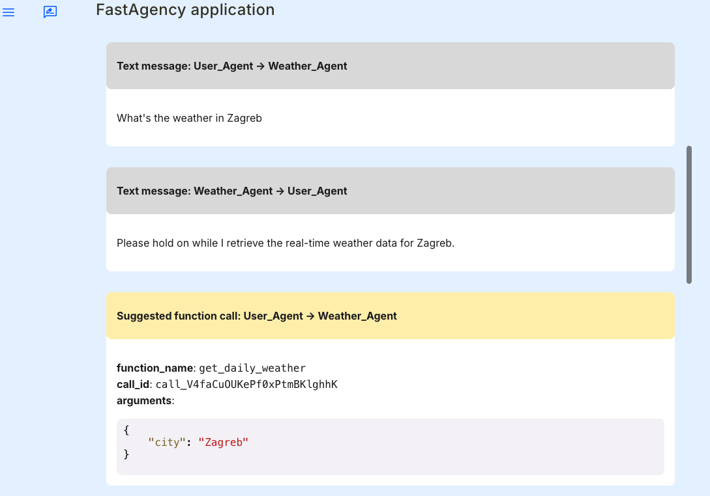

# Using Non-OpenAI Models with FastAgency

FastAgency makes it simple to work with **non-OpenAI models** through its [**AG2**](../../../api/fastagency/runtimes/ag2/ag2/Workflow.md) runtime. You can do this in a couple of ways:

- Using a [**proxy server that provides an OpenAI-compatible API**](https://docs.ag2.ai/docs/user-guide/models/litellm-proxy-server/installation){target="_blank"} or
- By [**using a custom model client class**](https://docs.ag2.ai/docs/blog/2024-01-26-Custom-Models/index){target="_blank"}, which lets you define and load your own models.

This flexibility allows you to **access a variety of models**, assign **tailored models to agents**, and **optimise inference costs**, among other advantages.

To show how simple it is to use **non-OpenAI models**, we'll **rewrite** the [**Weatherman chatbot**](./index.md#example-integrating-a-weather-api-with-autogen) example. With just a **few changes**, we'll switch to the [**Together AI**](https://www.together.ai){target="_blank"} Cloud platform, utilizing their **Meta-Llama-3.1-70B-Instruct-Turbo** model. For a comprehensive list of models available through Together AI, please refer to their official [**documentation**](https://docs.together.ai/docs/chat-models){target="_blank"}.

Let’s dive in!

## Installation

We **strongly recommend** using [**Cookiecutter**](../../../user-guide/cookiecutter/index.md) for setting up the project. Cookiecutter creates the project folder structure, default workflow, automatically installs all the necessary requirements, and creates a [devcontainer](https://code.visualstudio.com/docs/devcontainers/containers){target="_blank"} that can be used with [Visual Studio Code](https://code.visualstudio.com/){target="_blank"}.

You can setup the project using Cookiecutter by following the [**project setup guide**](../../../user-guide/cookiecutter/index.md).

Alternatively, you can use **pip + venv**. Before getting started, ensure that you have FastAgency installed. Run the following command:

```bash
pip install "fastagency[autogen,mesop,openapi]"
```

This command installs the FastAgency library along with the  [**AG2**](../../../api/fastagency/runtimes/ag2/ag2/Workflow.md) runtime and the [**mesop**](../../../api/fastagency/ui/mesop/MesopUI.md) and [**openapi**](../../../api/fastagency/api/openapi/OpenAPI.md) submodules. These components enable you to build  [**multi-agent workflows**](https://docs.ag2.ai/docs/user-guide/basic-concepts/orchestration/orchestrations){target="_blank"} and seamlessly integrate with the external [**Rest APIs**](https://en.wikipedia.org/wiki/REST){target="_blank"}.

## Prerequisites

Before you begin this guide, ensure you have:

- **Together AI account and API Key**: This guide uses [**Together AI's**](https://www.together.ai){target="_blank"} **Meta-Llama-3.1-70B-Instruct-Turbo** model, so you'll need access to it. Follow the steps in the section below to create your Together AI account and obtain your API key.


### Setting Up Your Together AI Account and API Key

**1. Create a Together AI account:**

- Go to <b><a href="https://api.together.ai" target="_blank">https://api.together.ai</a></b>.
- Choose a **sign-in** option and follow the instructions to create your account.
- If you already have an account, simply **log-in**.

**2. Obtain your API Key:**

- Once you complete the account creation process the API key will be displayed on the screen which you can copy.
- Or you can do the following to view your API key:
    - Tap on the person icon at the top right corner, and click [**Settings**](https://api.together.ai/settings/profile){target="_blank"}
    - On the left side bar, navigate to [**API Keys**](https://api.together.ai/settings/api-keys){target="_blank"}
    - **Copy your API key**, and you're ready to go!

#### Set Up Your API Keys in the Environment

To securely use the API keys in your project, you should store it as an [**environment variable**](https://en.wikipedia.org/wiki/Environment_variable){target="_blank"}.

Run the following command in the [**same terminal**](#running-the-application) where you will run the FastAgency application. This environment variable must be set for the application to function correctly; **skipping this step will cause the example application to crash**.

=== "Linux/macOS"
    ```bash
    export TOGETHER_API_KEY="your_together_api_key"
    ```
=== "Windows"
    ```bash
    set TOGETHER_API_KEY="your_together_api_key"
    ```

## Example: Integrating a Weather API with AG2

### Code Walkthrough

As we rewrite the existing [**Weatherman chatbox**](./index.md#example-integrating-a-weather-api-with-autogen) to use **non-OpenAI models**, most of the code remains unchanged. The only modifications to the original code are:

- **Configure the Language Model (LLM)**
- **Update the System Message**

Since the modifications are minor, **I will focus only on these differences in this guide**. For a **detailed explanation** of the original code, please refer to the original [**guide**](./index.md#autogen-in-fastagency).

#### 1. Configure the Language Model (LLM)

First, update the [**LLM**](https://en.wikipedia.org/wiki/Large_language_model){target="_blank"} configuration to use **non-OpenAI models**. For our example, we'll use **meta-llama/Meta-Llama-3.1-70B-Instruct-Turbo**, but you can choose any model from [**Together AI**](https://www.together.ai){target="_blank"} Cloud. For a complete list, refer to their official [**documentation**](https://docs.together.ai/docs/chat-models){target="_blank"}.


Next, add two parameters: `api_type` and `hide_tools`.

- `hide_tools`

    The [**`hide_tools`**](https://docs.ag2.ai/docs/user-guide/models/ollama#reducing-repetitive-tool-calls){target="_blank"} in [**AG2**](https://docs.ag2.ai/){target="_blank"} controls when tools are visible during [**LLM**](https://en.wikipedia.org/wiki/Large_language_model){target="_blank"} conversations. It addresses a common issue where LLMs might **repeatedly recommend tool calls**, even after they've been executed, potentially creating an **endless loop** of tool invocations.

    This parameter offers three options to control tool visibility:

    1. `never`: Tools are always visible to the LLM
    2. `if_all_run`: Tools are hidden once all the tools have been called
    3. `if_any_run`: Tools are hidden after any of the tool has been called

    In our example,  we set the `hide_tools` to `if_any_run`, to hide tools once any of them has been called, improving conversation flow.

- `api_type`

    Set the `api_type` to `together` to instruct FastAgency to use Together AI Cloud for model inference.

```python
{! docs_src/user_guide/runtimes/ag2/mesop/using_non_openai_models.py [ln:12-22] !}
```

#### 2. Update the System Message

The system message has been adjusted to work optimally with the **meta-llama/Meta-Llama-3.1-70B-Instruct-Turbo** model. You may need to experiment with the system prompt if you are using a different model.

```python
{! docs_src/user_guide/runtimes/ag2/mesop/using_non_openai_models.py [ln:27-32] !}
```

### Complete Application Code

<details>
<summary>main.py</summary>
```python
{! docs_src/user_guide/runtimes/ag2/mesop/using_non_openai_models.py !}
```
</details>

### Running the Application

The preferred way to run the [**Mesop**](https://google.github.io/mesop/){target="_blank"} application is using a Python WSGI HTTP server like [**Gunicorn**](https://gunicorn.org/){target="_blank"} on Linux and Mac or [**Waitress**](https://docs.pylonsproject.org/projects/waitress/en/stable/){target="_blank"} on Windows.

=== "Cookiecutter"
    !!! note "Terminal"
        ```console
        gunicorn main:app
        ```
=== "env + pip"

    First, install the package using package manager such as `pip` and then run it:

    === "Linux/MacOS"
        !!! note "Terminal"
            ```console
            pip install gunicorn
            gunicorn main:app
            ```

    === "Windows"
        !!! note "Terminal"
            ```console
            pip install waitress
            waitress-serve --listen=0.0.0.0:8000 main:app
            ```

### Output

Once you run the command above, FastAgency will start a [**Mesop**](https://google.github.io/mesop/){target="_blank"} application. Below is the output from the terminal along with a partial screenshot of the Mesop application:

```console
[2024-10-10 13:19:18 +0530] [23635] [INFO] Starting gunicorn 23.0.0
[2024-10-10 13:19:18 +0530] [23635] [INFO] Listening at: http://127.0.0.1:8000 (23635)
[2024-10-10 13:19:18 +0530] [23635] [INFO] Using worker: sync
[2024-10-10 13:19:18 +0530] [23645] [INFO] Booting worker with pid: 23645
```



This example demonstrates the power of [**AG2**](../../../api/fastagency/runtimes/ag2/ag2/Workflow.md) runtime in FastAgency, highlighting how easily you can use **non-OpenAI models** with just a few changes in the code. With FastAgency, developers can **quickly build interactive**, **scalable applications** that work with live data sources.
